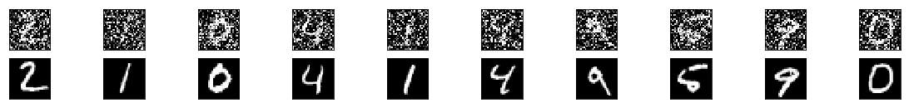
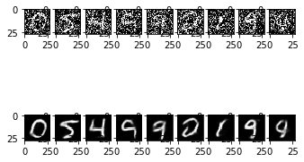

```python
import numpy as np
from keras.datasets import mnist 
from keras.layers import Input, Dense, Conv2D, MaxPooling2D, UpSampling2D
from keras.models import Model
from matplotlib import pyplot as plt
```

    Using TensorFlow backend.


```python
(x_train , _) , (x_test , _) = mnist.load_data()

x_train = x_train.astype('float32') /255.
x_test = x_test.astype('float32') /255.

x_train = np.reshape(x_train , (len(x_train) , 28 , 28 , 1))
x_test = np.reshape(x_test , (len(x_test) , 28 , 28 , 1))

noise_f = 0.7
x_train_n = x_train + noise_f*np.random.normal(loc = 0.0 , scale = 1.0 ,size = x_train.shape )
x_test_n = x_test + noise_f*np.random.normal(loc = 0.0 , scale = 1.0 , size = x_test.shape )

x_train_n = np.clip(x_train_n , 0. , 1.)
x_test_n = np.clip(x_test_n , 0. , 1.)
```

    Downloading data from https://s3.amazonaws.com/img-datasets/mnist.npz
    11264000/11490434 [============================>.] - ETA: 0s


```python
n = 10
plt.figure(figsize = (20,2))
for i in range(1,n+1) :
	ax = plt.subplot(2,n,i)
	plt.imshow(x_test_n[i].reshape(28,28))
	plt.gray()
	ax.get_xaxis().set_visible(False)
	ax.get_yaxis().set_visible(False)
	bx = plt.subplot(2,n,i+n)
	plt.imshow(x_test[i].reshape((28,28)))
	plt.gray()
	bx.get_xaxis().set_visible(False)
	bx.get_yaxis().set_visible(False)
plt.show()


```





```python
input_img = Input(shape=(28, 28, 1))  # adapt this if using `channels_first` image data format

x = Conv2D(32, (3, 3), activation='relu', padding='same')(input_img)
x = MaxPooling2D((2, 2), padding='same')(x)
x = Conv2D(32, (3, 3), activation='relu', padding='same')(x)
encoded = MaxPooling2D((2, 2), padding='same')(x)

# at this point the representation is (7, 7, 32)

x = Conv2D(32, (3, 3), activation='relu', padding='same')(encoded)
x = UpSampling2D((2, 2))(x)
x = Conv2D(32, (3, 3), activation='relu', padding='same')(x)
x = UpSampling2D((2, 2))(x)
decoded = Conv2D(1, (3, 3), activation='sigmoid', padding='same')(x)

autoencoder = Model(input_img, decoded)
autoencoder.compile(optimizer='adadelta', loss='binary_crossentropy' , metrics = ['acc'])


```


```python
autoencoder.fit(x_train_n, x_train,
                epochs=100,
                batch_size=512,
                shuffle=True,
                validation_data=(x_test_n, x_test))
                # callbacks=[TensorBoard(log_dir='/tmp/tb',
                # histogram_freq=0, 
                # write_graph=False)])
```

    Train on 60000 samples, validate on 10000 samples
    Epoch 1/100
    60000/60000 [==============================] - 7s - loss: 0.3495 - acc: 0.8031 - val_loss: 0.2296 - val_acc: 0.8073
    Epoch 2/100
    60000/60000 [==============================] - 6s - loss: 0.2061 - acc: 0.7971 - val_loss: 0.1848 - val_acc: 0.8034
    Epoch 3/100
    60000/60000 [==============================] - 6s - loss: 0.1785 - acc: 0.7994 - val_loss: 0.1718 - val_acc: 0.8053
    Epoch 4/100
    60000/60000 [==============================] - 6s - loss: 0.1674 - acc: 0.8017 - val_loss: 0.1628 - val_acc: 0.8067
    Epoch 5/100
    60000/60000 [==============================] - 6s - loss: 0.1601 - acc: 0.8031 - val_loss: 0.1539 - val_acc: 0.8065
    Epoch 6/100
    60000/60000 [==============================] - 6s - loss: 0.1546 - acc: 0.8041 - val_loss: 0.1517 - val_acc: 0.8077
    Epoch 7/100
    60000/60000 [==============================] - 6s - loss: 0.1507 - acc: 0.8049 - val_loss: 0.1482 - val_acc: 0.8080
    Epoch 8/100
    60000/60000 [==============================] - 6s - loss: 0.1478 - acc: 0.8055 - val_loss: 0.1457 - val_acc: 0.8080
    Epoch 9/100
    60000/60000 [==============================] - 6s - loss: 0.1452 - acc: 0.8060 - val_loss: 0.1439 - val_acc: 0.8085
    Epoch 10/100
    60000/60000 [==============================] - 6s - loss: 0.1432 - acc: 0.8063 - val_loss: 0.1448 - val_acc: 0.8093
    Epoch 11/100
    60000/60000 [==============================] - 6s - loss: 0.1414 - acc: 0.8067 - val_loss: 0.1405 - val_acc: 0.8088
    Epoch 12/100
    60000/60000 [==============================] - 6s - loss: 0.1400 - acc: 0.8069 - val_loss: 0.1369 - val_acc: 0.8082
    Epoch 13/100
    60000/60000 [==============================] - 6s - loss: 0.1386 - acc: 0.8072 - val_loss: 0.1376 - val_acc: 0.8090
    Epoch 14/100
    60000/60000 [==============================] - 6s - loss: 0.1378 - acc: 0.8073 - val_loss: 0.1346 - val_acc: 0.8084
    Epoch 15/100
    60000/60000 [==============================] - 6s - loss: 0.1364 - acc: 0.8076 - val_loss: 0.1354 - val_acc: 0.8090
    Epoch 16/100
    60000/60000 [==============================] - 6s - loss: 0.1356 - acc: 0.8077 - val_loss: 0.1343 - val_acc: 0.8091
    Epoch 17/100
    60000/60000 [==============================] - 6s - loss: 0.1349 - acc: 0.8079 - val_loss: 0.1332 - val_acc: 0.8090
    Epoch 18/100
    60000/60000 [==============================] - 6s - loss: 0.1341 - acc: 0.8080 - val_loss: 0.1330 - val_acc: 0.8092
    Epoch 19/100
    60000/60000 [==============================] - 6s - loss: 0.1335 - acc: 0.8081 - val_loss: 0.1307 - val_acc: 0.8083
    Epoch 20/100
    60000/60000 [==============================] - 6s - loss: 0.1329 - acc: 0.8082 - val_loss: 0.1308 - val_acc: 0.8089
    Epoch 21/100
    60000/60000 [==============================] - 6s - loss: 0.1326 - acc: 0.8083 - val_loss: 0.1307 - val_acc: 0.8090
    Epoch 22/100
    60000/60000 [==============================] - 6s - loss: 0.1315 - acc: 0.8085 - val_loss: 0.1315 - val_acc: 0.8097
    Epoch 23/100
    60000/60000 [==============================] - 6s - loss: 0.1310 - acc: 0.8085 - val_loss: 0.1286 - val_acc: 0.8075
    Epoch 24/100
    60000/60000 [==============================] - 6s - loss: 0.1306 - acc: 0.8086 - val_loss: 0.1295 - val_acc: 0.8062
    Epoch 25/100
    60000/60000 [==============================] - 6s - loss: 0.1304 - acc: 0.8086 - val_loss: 0.1290 - val_acc: 0.8064
    Epoch 26/100
    60000/60000 [==============================] - 6s - loss: 0.1298 - acc: 0.8087 - val_loss: 0.1291 - val_acc: 0.8095
    Epoch 27/100
    60000/60000 [==============================] - 6s - loss: 0.1296 - acc: 0.8088 - val_loss: 0.1280 - val_acc: 0.8090
    Epoch 28/100
    60000/60000 [==============================] - 6s - loss: 0.1291 - acc: 0.8089 - val_loss: 0.1280 - val_acc: 0.8063
    Epoch 29/100
    60000/60000 [==============================] - 6s - loss: 0.1289 - acc: 0.8089 - val_loss: 0.1279 - val_acc: 0.8093
    Epoch 30/100
    60000/60000 [==============================] - 6s - loss: 0.1287 - acc: 0.8089 - val_loss: 0.1270 - val_acc: 0.8091
    Epoch 31/100
    60000/60000 [==============================] - 6s - loss: 0.1283 - acc: 0.8090 - val_loss: 0.1266 - val_acc: 0.8086
    Epoch 32/100
    60000/60000 [==============================] - 6s - loss: 0.1282 - acc: 0.8090 - val_loss: 0.1271 - val_acc: 0.8094
    Epoch 33/100
    60000/60000 [==============================] - 6s - loss: 0.1280 - acc: 0.8091 - val_loss: 0.1271 - val_acc: 0.8096
    Epoch 34/100
    60000/60000 [==============================] - 6s - loss: 0.1277 - acc: 0.8091 - val_loss: 0.1272 - val_acc: 0.8097
    Epoch 35/100
    60000/60000 [==============================] - 6s - loss: 0.1276 - acc: 0.8091 - val_loss: 0.1264 - val_acc: 0.8095
    Epoch 36/100
    60000/60000 [==============================] - 6s - loss: 0.1274 - acc: 0.8092 - val_loss: 0.1282 - val_acc: 0.8102
    Epoch 37/100
    60000/60000 [==============================] - 6s - loss: 0.1271 - acc: 0.8092 - val_loss: 0.1271 - val_acc: 0.8099
    Epoch 38/100
    60000/60000 [==============================] - 6s - loss: 0.1270 - acc: 0.8092 - val_loss: 0.1259 - val_acc: 0.8069
    Epoch 39/100
    60000/60000 [==============================] - 6s - loss: 0.1267 - acc: 0.8092 - val_loss: 0.1249 - val_acc: 0.8080
    Epoch 40/100
    60000/60000 [==============================] - 6s - loss: 0.1265 - acc: 0.8093 - val_loss: 0.1268 - val_acc: 0.8061
    Epoch 41/100
    60000/60000 [==============================] - 6s - loss: 0.1265 - acc: 0.8093 - val_loss: 0.1248 - val_acc: 0.8092
    Epoch 42/100
    60000/60000 [==============================] - 6s - loss: 0.1260 - acc: 0.8094 - val_loss: 0.1245 - val_acc: 0.8080
    Epoch 43/100
    60000/60000 [==============================] - 6s - loss: 0.1260 - acc: 0.8093 - val_loss: 0.1245 - val_acc: 0.8080
    Epoch 44/100
    60000/60000 [==============================] - 6s - loss: 0.1259 - acc: 0.8094 - val_loss: 0.1250 - val_acc: 0.8072
    Epoch 45/100
    60000/60000 [==============================] - 6s - loss: 0.1258 - acc: 0.8094 - val_loss: 0.1244 - val_acc: 0.8093
    Epoch 46/100
    60000/60000 [==============================] - 6s - loss: 0.1256 - acc: 0.8094 - val_loss: 0.1252 - val_acc: 0.8068
    Epoch 47/100
    60000/60000 [==============================] - 6s - loss: 0.1253 - acc: 0.8095 - val_loss: 0.1246 - val_acc: 0.8096
    Epoch 48/100
    60000/60000 [==============================] - 6s - loss: 0.1254 - acc: 0.8094 - val_loss: 0.1268 - val_acc: 0.8103
    Epoch 49/100
    60000/60000 [==============================] - 6s - loss: 0.1253 - acc: 0.8095 - val_loss: 0.1247 - val_acc: 0.8096
    Epoch 50/100
    60000/60000 [==============================] - 6s - loss: 0.1250 - acc: 0.8095 - val_loss: 0.1233 - val_acc: 0.8088
    Epoch 51/100
    60000/60000 [==============================] - 6s - loss: 0.1250 - acc: 0.8095 - val_loss: 0.1237 - val_acc: 0.8077
    Epoch 52/100
    60000/60000 [==============================] - 6s - loss: 0.1250 - acc: 0.8095 - val_loss: 0.1240 - val_acc: 0.8095
    Epoch 53/100
    60000/60000 [==============================] - 6s - loss: 0.1248 - acc: 0.8095 - val_loss: 0.1232 - val_acc: 0.8085
    Epoch 54/100
    60000/60000 [==============================] - 6s - loss: 0.1247 - acc: 0.8095 - val_loss: 0.1233 - val_acc: 0.8079
    Epoch 55/100
    60000/60000 [==============================] - 6s - loss: 0.1246 - acc: 0.8095 - val_loss: 0.1246 - val_acc: 0.8070
    Epoch 56/100
    60000/60000 [==============================] - 6s - loss: 0.1244 - acc: 0.8096 - val_loss: 0.1231 - val_acc: 0.8091
    Epoch 57/100
    60000/60000 [==============================] - 6s - loss: 0.1242 - acc: 0.8096 - val_loss: 0.1233 - val_acc: 0.8082
    Epoch 58/100
    60000/60000 [==============================] - 6s - loss: 0.1242 - acc: 0.8096 - val_loss: 0.1233 - val_acc: 0.8076
    Epoch 59/100
    60000/60000 [==============================] - 6s - loss: 0.1241 - acc: 0.8096 - val_loss: 0.1229 - val_acc: 0.8093
    Epoch 60/100
    60000/60000 [==============================] - 6s - loss: 0.1241 - acc: 0.8096 - val_loss: 0.1234 - val_acc: 0.8096
    Epoch 61/100
    60000/60000 [==============================] - 6s - loss: 0.1241 - acc: 0.8096 - val_loss: 0.1228 - val_acc: 0.8088
    Epoch 62/100
    60000/60000 [==============================] - 6s - loss: 0.1241 - acc: 0.8096 - val_loss: 0.1240 - val_acc: 0.8068
    Epoch 63/100
    60000/60000 [==============================] - 6s - loss: 0.1241 - acc: 0.8096 - val_loss: 0.1235 - val_acc: 0.8073
    Epoch 64/100
    60000/60000 [==============================] - 6s - loss: 0.1237 - acc: 0.8097 - val_loss: 0.1226 - val_acc: 0.8079
    Epoch 65/100
    60000/60000 [==============================] - 6s - loss: 0.1239 - acc: 0.8097 - val_loss: 0.1228 - val_acc: 0.8080
    Epoch 66/100
    60000/60000 [==============================] - 6s - loss: 0.1238 - acc: 0.8097 - val_loss: 0.1237 - val_acc: 0.8101
    Epoch 67/100
    60000/60000 [==============================] - 6s - loss: 0.1236 - acc: 0.8097 - val_loss: 0.1229 - val_acc: 0.8076
    Epoch 68/100
    60000/60000 [==============================] - 6s - loss: 0.1235 - acc: 0.8097 - val_loss: 0.1222 - val_acc: 0.8089
    Epoch 69/100
    60000/60000 [==============================] - 6s - loss: 0.1234 - acc: 0.8097 - val_loss: 0.1229 - val_acc: 0.8098
    Epoch 70/100
    60000/60000 [==============================] - 6s - loss: 0.1234 - acc: 0.8097 - val_loss: 0.1231 - val_acc: 0.8100
    Epoch 71/100
    60000/60000 [==============================] - 6s - loss: 0.1233 - acc: 0.8098 - val_loss: 0.1237 - val_acc: 0.8100
    Epoch 72/100
    60000/60000 [==============================] - 6s - loss: 0.1231 - acc: 0.8098 - val_loss: 0.1226 - val_acc: 0.8078
    Epoch 73/100
    60000/60000 [==============================] - 6s - loss: 0.1230 - acc: 0.8098 - val_loss: 0.1229 - val_acc: 0.8099
    Epoch 74/100
    60000/60000 [==============================] - 6s - loss: 0.1230 - acc: 0.8098 - val_loss: 0.1220 - val_acc: 0.8094
    Epoch 75/100
    60000/60000 [==============================] - 6s - loss: 0.1228 - acc: 0.8098 - val_loss: 0.1217 - val_acc: 0.8092
    Epoch 76/100
    60000/60000 [==============================] - 6s - loss: 0.1227 - acc: 0.8098 - val_loss: 0.1220 - val_acc: 0.8083
    Epoch 77/100
    60000/60000 [==============================] - 6s - loss: 0.1229 - acc: 0.8098 - val_loss: 0.1223 - val_acc: 0.8097
    Epoch 78/100
    60000/60000 [==============================] - 6s - loss: 0.1227 - acc: 0.8098 - val_loss: 0.1217 - val_acc: 0.8091
    Epoch 79/100
    60000/60000 [==============================] - 6s - loss: 0.1226 - acc: 0.8099 - val_loss: 0.1227 - val_acc: 0.8100
    Epoch 80/100
    60000/60000 [==============================] - 6s - loss: 0.1227 - acc: 0.8098 - val_loss: 0.1221 - val_acc: 0.8099
    Epoch 81/100
    60000/60000 [==============================] - 6s - loss: 0.1224 - acc: 0.8099 - val_loss: 0.1213 - val_acc: 0.8088
    Epoch 82/100
    60000/60000 [==============================] - 6s - loss: 0.1226 - acc: 0.8099 - val_loss: 0.1218 - val_acc: 0.8097
    Epoch 83/100
    60000/60000 [==============================] - 6s - loss: 0.1225 - acc: 0.8099 - val_loss: 0.1212 - val_acc: 0.8090
    Epoch 84/100
    60000/60000 [==============================] - 6s - loss: 0.1224 - acc: 0.8099 - val_loss: 0.1214 - val_acc: 0.8088
    Epoch 85/100
    60000/60000 [==============================] - 6s - loss: 0.1222 - acc: 0.8099 - val_loss: 0.1220 - val_acc: 0.8097
    Epoch 86/100
    60000/60000 [==============================] - 6s - loss: 0.1225 - acc: 0.8099 - val_loss: 0.1218 - val_acc: 0.8097
    Epoch 87/100
    60000/60000 [==============================] - 6s - loss: 0.1224 - acc: 0.8099 - val_loss: 0.1219 - val_acc: 0.8099
    Epoch 88/100
    60000/60000 [==============================] - 6s - loss: 0.1223 - acc: 0.8099 - val_loss: 0.1216 - val_acc: 0.8079
    Epoch 89/100
    60000/60000 [==============================] - 6s - loss: 0.1223 - acc: 0.8099 - val_loss: 0.1212 - val_acc: 0.8082
    Epoch 90/100
    60000/60000 [==============================] - 6s - loss: 0.1222 - acc: 0.8099 - val_loss: 0.1212 - val_acc: 0.8083
    Epoch 91/100
    60000/60000 [==============================] - 6s - loss: 0.1222 - acc: 0.8099 - val_loss: 0.1217 - val_acc: 0.8078
    Epoch 92/100
    60000/60000 [==============================] - 6s - loss: 0.1220 - acc: 0.8099 - val_loss: 0.1209 - val_acc: 0.8093
    Epoch 93/100
    60000/60000 [==============================] - 6s - loss: 0.1221 - acc: 0.8099 - val_loss: 0.1219 - val_acc: 0.8100
    Epoch 94/100
    60000/60000 [==============================] - 6s - loss: 0.1220 - acc: 0.8099 - val_loss: 0.1215 - val_acc: 0.8098
    Epoch 95/100
    60000/60000 [==============================] - 6s - loss: 0.1219 - acc: 0.8100 - val_loss: 0.1210 - val_acc: 0.8082
    Epoch 96/100
    60000/60000 [==============================] - 6s - loss: 0.1219 - acc: 0.8100 - val_loss: 0.1211 - val_acc: 0.8097
    Epoch 97/100
    60000/60000 [==============================] - 6s - loss: 0.1219 - acc: 0.8100 - val_loss: 0.1206 - val_acc: 0.8091
    Epoch 98/100
    60000/60000 [==============================] - 6s - loss: 0.1218 - acc: 0.8100 - val_loss: 0.1212 - val_acc: 0.8080
    Epoch 99/100
    60000/60000 [==============================] - 6s - loss: 0.1219 - acc: 0.8100 - val_loss: 0.1207 - val_acc: 0.8090
    Epoch 100/100
    60000/60000 [==============================] - 6s - loss: 0.1215 - acc: 0.8100 - val_loss: 0.1214 - val_acc: 0.8101


    <keras.callbacks.History at 0x7faad814be80>


```python
n = 10
for i in range(1,n):
    dig = 100 + i
    sample_img = x_test[dig]
    sample_img_n = x_test_n[dig]
    plt.subplot(2,n,i)
    plt.imshow(sample_img_n.reshape((28,28)))
    f = autoencoder.predict(sample_img_n.reshape(1,28,28,1))
    plt.subplot(2,n,i+n)
    plt.imshow(f.reshape(28,28))
plt.show()
```





```python

```
